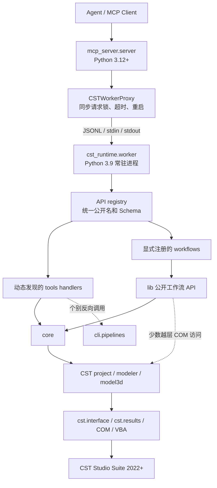
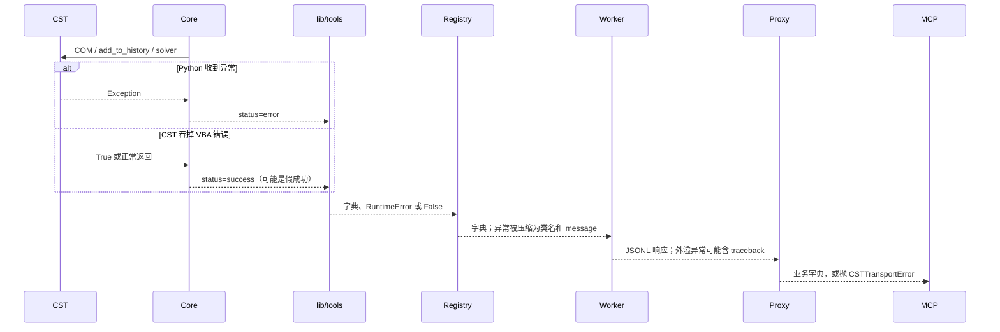

# CST Runtime / MCP 项目交接与仓库审阅说明

## 一、项目背景

项目最初基于开源仓库：

- 上游仓库：`bbl21/cst-runtime-cli`
- 当前修改仓库：`phy233/CST_MCP`

目标是为 CST Studio Suite 建立一套适合 AI Agent 使用的自动化 Runtime，重点支持 CST 2022，同时保留对新版本 CST 官方 Python API 的利用。

当前主要使用场景：

- 参数化创建 CST 工程；
- 创建材料、几何体和阵列；
- 设置边界、端口、网格、监视器和求解器；
- 启动仿真并轮询状态；
- 导出 S 参数、远场和场分布；
- 通过 MCP 将这些能力暴露给 OpenCode、Codex、DeepSeek 等 Agent。

项目不计划扩展到 HFSS 或 COMSOL。

---
# 二、初步代码分析
## CST Runtime / MCP 源码审阅报告

> 审阅日期：2026-07-31
> 本地基线：当前工作树，`HEAD=d62a5d6`
> 审阅方式：只读静态分析；未运行测试、构建、CST、MCP Server 或 Worker
> 首要目标：识别 CST 2022 静默失败风险，并给出最小错误 Gateway 方案

### 0. 结论摘要与证据口径

#### 0.1 总体判断

当前仓库已经建立了有价值的双 Python 进程隔离、常驻 Worker、统一工具注册表、工程身份校验、Command Buffer 和部分 CST 安全守卫。MCP 层没有直接导入 `cst_runtime`，这一关键隔离成立。

但当前真实依赖关系不是交接说明中的简单线性结构 `Worker → lib → core`：原子工具通常是 `Worker → API registry → tools → core`，工作流通常是 `Worker → API registry → workflows → lib → core`，而少数 `lib` 函数又直接访问 CST COM 对象。最严重的问题仍是 `_add_vba_history()` 在 COM 调用未抛异常时无条件返回 `success`，这会把 CST 2022 已知的 VBA 运行时错误或语法错误误报成成功。

因此，项目目前可以称为“传输层和分层重构基本完成”，但还不能称为“建模执行结果可靠”。在错误 Gateway 和后置验证落地前，Agent 不应仅凭 `status=success` 宣称实体、材料、边界、端口或参数已经正确写入 CST。

#### 0.2 证据标签

| 标签                   | 含义                                             |
| ---------------------- | ------------------------------------------------ |
| **[源码确认]**   | 可由本地或固定版本的公开源码直接证明             |
| **[交接实测]**   | 来自交接材料记录的 CST 2022 实验，本轮未复测     |
| **[合理推断]**   | 由调用链和已知行为推导，尚未用 CST 2022 真机复核 |
| **[待真机验证]** | 必须在隔离的 CST 2022 临时工程中确认             |

#### 0.3 外部源码固定版本

- `bbl21/cst-runtime-cli`：公开 `master` 的固定提交 [`7eac82190845083396889a7ae96ed22c2118a892`](https://github.com/bbl21/cst-runtime-cli/tree/7eac82190845083396889a7ae96ed22c2118a892)，提交时间 2026-06-24。
- HERMES `cst-python-api`：公开 `main` 的固定提交 [`72b0e13f56a57749f640191abe2239a4e222a53b`](https://src.koda.cnrs.fr/hermes/cst-python-api/-/tree/72b0e13f56a57749f640191abe2239a4e222a53b)，提交时间 2026-06-29。
- 本报告只做源码与架构比较。由于本地没有 `upstream/master` 跟踪引用，不伪造逐提交共同祖先或精确增删统计。

### 1. 当前仓库真实架构图



#### 1.1 已成立的架构约束

- **[源码确认]** `mcp_server/server.py:7-8` 只导入本层 `config` 和 `proxy`；`tests/test_mcp_server.py:42-57` 也以 AST 检查 MCP 层不得导入 `cst_runtime`。
- **[源码确认]** `mcp_server/proxy.py:66-77` 使用指定解释器启动 `python -m cst_runtime.worker`，通信为 UTF-8 JSONL，且 `shell=False`。
- **[源码确认]** `mcp_server/proxy.py:145-175` 用重入锁串行化请求，以 UUID 校验响应；超时后终止 Worker，避免迟到响应污染下一次调用。
- **[源码确认]** `cst_runtime/worker.py:36-67` 只接受 `ping`、`describe_tools`、`call_tool` 三类白名单动作，不允许客户端指定任意模块和函数。
- **[源码确认]** `cst_runtime/api/registry.py:268-294` 将原子工具和三个工作流合并为统一操作/工具视图。

#### 1.2 与交接说明不同的当前事实

- **[源码确认]** 工具清单不是 MCP 侧静态维护。`api/atomic.py:27-39` 会导入受控模块并扫描全部 `tool_*` 可调用对象，`server.py:21-22` 又在服务器创建时通过 Worker 动态读取描述。
- **[源码确认]** 动态发现是“限定模块白名单内的动态发现”，不是对整个 `lib` 任意扫描；安全性明显好于旧 Adapter，但仍应在文档中准确表述。
- **[源码确认]** 当前 `tools-list.json` 含 117 个条目；README 写 113 个，`skills/cst-mcp/SKILL.md` 写“不复制 114 个工具”，`INSTALL.md` 仍写 20 个工具，四者不一致。
- **[源码确认]** Worker 仍会在 `worker.py:25-33` 修改自身 `sys.path` 以加载 CST 库；真正被移除的是 MCP 进程直接修改路径并导入 Runtime 的旧方式。
- **[源码确认]** 关于MCP的工具全部修改至通过`lib`层调用，与`core`层解耦（该点为代码审查后做出的修改，人工补充至此）。

### 2. 问题清单（按严重程度）

#### P0：建模 History 的“成功”可能是假成功

**证据：**

- **[源码确认]** `core/modeling.py:13-45` 调用 `project.modeler.add_to_history(...)` 后，只要 Python 没收到异常，就直接返回 `status=success`；没有检查返回值、状态文件或模型后置条件。
- **[交接实测]** CST 2022 中，不存在材料和明显 VBA 语法错误仍可能让 `add_to_history` 返回 `True`，错误只出现在 Message Window。
- **[源码确认]** `core/modeling.py:15-17` 在批处理模式下甚至尚未提交 CST 就返回 `success`，该状态实际只代表“已加入内存缓冲区”。

**影响：** Agent 可能在模型未创建、只创建一部分或 History 含错误时继续保存、仿真和导出，最终得到错误但表面完整的结果链。

**建议：** 第一优先级引入批次级错误 Gateway；把“已缓冲、已提交、VBA 报告成功、后置验证通过”拆成不同状态，不再复用一个 `success`。

### P0：Command Buffer 在提交前被弹出，失败后命令丢失

- **[源码确认]** `core/buffer.py:53-58` 的 `pop_batch()` 先从全局字典删除缓冲区。
- **[源码确认]** `core/modeling.py:65-77` 随后才把脚本提交给 CST。
- **[合理推断]** 若 attach、COM 提交、Worker 或 CST 在两者之间失败，内存中的原始批次无法重试或诊断；当前返回中也没有批次脚本摘要、哈希或 `operation_id`。

**建议：** 将 flush 改为 `peek → submit/verify → commit_remove`；失败时保留或显式归档批次，成功后才删除。VBA 状态文件应按“整个 flush”创建一次，不能按阵列单元创建。

### P1：CST 2022 仍有直接 `model3d` 访问和错误吞噬

- **[源码确认]** `core/project.py:67-114` 的参数枚举必须经过 `get_model3d()`，CST 2022 无此对象时直接失败。
- **[源码确认]** `lib/solver.py:139-177` 直接调用 `project.model3d.DeleteResults()` 和 `GetSolverType()`，绕过兼容层。
- **[源码确认]** `lib/results.py:141-158` 直接调用 `project.model3d.ResultTree...`，任何异常都被转成 `False`；“接口不支持”“COM 故障”和“结果不存在”无法区分。
- **[源码确认]** `lib/materials.py:84-109` 直接访问 `project.modeler.get_tree_items()`，异常时返回空列表；`exists()` 又会把异常当成“不存在”。

**影响：** 兼容故障可能被误解释为业务上的对象不存在，导致 Agent 重复创建、错误分支或破坏已有对象。

**建议：** 所有 COM 查询下沉到 `core/compatibility`，返回结构化的 `unsupported_feature` 或 `cst_query_error`；公开 `lib` 不直接持有/访问项目 COM 对象。

#### P1：兼容层的能力检测可能被 RemoteObject 代理误导

- **[源码确认]** `compatibility/base.py:7-11`、`parameters.py:7-12`、`farfield.py:8-23` 主要依靠 `hasattr()`。
- **[源码确认]** `base.py:10` 硬编码“requires CST 2023+”，但本仓库没有官方版本矩阵或固定实测记录证明精确起始版本。
- **[源码确认]** `tree.py:13-26` 的新版路径没有捕获调用失败并尝试旧版路径；只在旧版 `filter` 参数触发 `TypeError` 时回退。
- **[合理推断]** 动态 RemoteObject 可能让属性存在性检测通过，但真正调用仍失败。

**建议：** 使用“安全、只读、可重复”的能力探针，并分别记录 `attribute_missing`、`call_unsupported`、`call_failed`；版本文本改为“当前运行时未提供该能力”，精确版本仅作为经验证的元数据。

#### P1：错误契约在各层之间不统一

- **[源码确认]** `core/errors.py:11-26` 采用 `{status, error_type, message}` 字典。
- **[源码确认]** 多数 `lib` 包装器又把错误字典转换为普通 `RuntimeError`；部分布尔查询把错误吞成 `False`。
- **[源码确认]** `api/registry.py:307-323` 只保留异常类名和字符串，阶段、CST 原始信息、回滚和恢复建议都丢失。
- **[源码确认]** `worker.py:60-66` 对注册表外溢异常返回完整 Python traceback；这既可能暴露本机路径，也不符合面向 Agent 的稳定错误接口。
- **[源码确认]** Proxy 的启动、IPC、退出和超时错误抛 `CSTTransportError`，`server.py:40-52` 未把它标准化成与业务错误相同的信封。

**建议：** 引入单一错误信封，并让 `validation/transport/worker/submission/execution/verification/rollback` 成为稳定阶段；Worker traceback 仅写受控诊断日志，不默认返回 MCP 客户端。

#### P1：远场即时 VBA 的最终 fallback 再次产生假成功

- **[源码确认]** `core/farfield.py:161-201` 优先尝试 `schematic.execute_vba_code` 和新版私有入口，这些异常至少可被捕获。
- **[源码确认]** `core/farfield.py:203-210` 最后回退到 `modeler.add_to_history` 后无条件返回成功，重新引入同一静默失败问题。
- **[交接实测]** `schematic.execute_vba_code` 在 CST 2022 会对语法或运行时错误抛出 `RuntimeError`，但它不写建模 History，不能替代常规参数化建模。

**建议：** 保留即时 VBA 与 History 两条语义明确的路径；History fallback 必须进入统一 Gateway，不能伪装成与 `execute_vba_code` 等价的可靠执行。

#### P2：实际依赖方向仍存在越层和反向依赖

- **[源码确认]** `tools/simulation.py:72-81` 从 `tools` 反向导入 `cli.pipelines.impl`。
- **[源码确认]** `tools/__init__.py:27-47` 为构建工具对象导入 `cst_runtime.cli.dispatch._tool_governance`。
- **[源码确认]** 多数原子 `tools` 直接调用 `core`，工作流则通过 `lib`；因此 `lib` 并不是所有公开入口的唯一稳定 API。
- **[源码确认]** `lib/materials.py`、`lib/solver.py`、`lib/results.py` 存在直接 COM 访问。

**建议：** 固定依赖为 `transport adapters → application API/registry → workflows/tools adapters → lib services → core drivers`。CLI 治理逻辑应上移到协议无关 API 层，避免 tools 依赖 CLI。

#### P2：仿真状态语义仍可能过度乐观

- **[源码确认]** `core/simulation.py:17-40` 在 `run_solver()` 返回后直接写“simulation completed”，没有读取求解器终态、错误码或结果存在性。
- **[源码确认]** `start_solver()` 返回后直接写“simulation started”；轮询只读取 `is_solver_running()`，不能区分“成功结束”和“启动后立刻失败”。
- **[源码确认]** `lib/solver.py:95-107` 在状态查询报错时返回 `False`，调用者可能把查询失败误认成“仿真已结束”。

**建议：** 轮询结果至少区分 `running/completed/failed/unknown/query_error`，并用预期结果树或求解器日志作为完成后验证。

#### P2：原始 VBA 工具扩大了 Agent 风险面

- **[源码确认]** `tools/modeling.py:44-45,2086` 暴露通用 `add_to_history` 工具。
- **[合理推断]** 即使 Schema 将其标记为写操作，Agent 仍可提交未经过业务校验的任意 VBA；现有静默成功会进一步放大风险。

**建议：** 默认不向普通 Agent 工作流暴露，或标记为高风险专家工具；要求显式启用、工程副本和 `strict` 验证。

#### P3：文档、版本和工具数量已经漂移

- **[源码确认]** 根 `pyproject.toml:23-24` 指向不存在或错误归属的 `bbl21/cst-mcp`，当前远程实际是 `phy233/CST_MCP`。
- **[源码确认]** README 要求 CST 2026/Python 3.13+，INSTALL 要求 CST 2022+/MCP Python 3.12+/Worker 3.9。
- **[源码确认]** README clone 示例仍指向 `anomalyco/cst-runtime-cli`。
- **[源码确认]** `INSTALL.md` 描述 FastMCP、20 个工具、`cst_worker.py` 和 `conda run`，当前源码实际使用低层 `mcp.server.Server`、117 条已导出清单、`cst_runtime.worker` 和直接解释器路径。
- **[源码确认]** `docs/implementation-plan.md` 和 `docs/MCP待完成任务清单.md` 仍大量描述已删除 Adapter，容易误导维护者。

### 3. 当前错误处理调用链



#### 3.1 当前存在的三类“成功”被混在一起

1. 已加入 Command Buffer，尚未接触 CST。
2. COM/History 提交没有向 Python 抛异常。
3. 业务目标真实成立。

当前多数建模 API 把前两类都写成 `status=success`，但系统真正需要的是第三类。建议以后明确使用：

```json
{
  "ok": true,
  "submission": "accepted",
  "execution": "reported_ok",
  "verification": "passed"
}
```

若尚未验证，则必须写 `verification: "not_run"`，而不是省略后仍由上层推断成功。

### 4. CST 2022 中可能静默失败或误判的 API 清单

| 入口                                            | 本地位置                     | 目的                     | 当前错误可见性                | CST 2022 判断                              | 迁移建议              |
| ----------------------------------------------- | ---------------------------- | ------------------------ | ----------------------------- | ------------------------------------------ | --------------------- |
| `modeler.add_to_history`                      | `core/modeling.py:32`      | 绝大多数建模/设置        | 仅 Python/COM 异常            | **[交接实测]** VBA 错误可能返回 True | P0，统一 Gateway      |
| 缓冲追加                                        | `core/modeling.py:15-17`   | 批量 VBA                 | 尚未执行却返回成功            | **[源码确认]**                       | 改为`buffered` 状态 |
| 批量 flush                                      | `core/modeling.py:65-77`   | 合并 History 节点        | 弹出后提交，无后置验证        | **[合理推断]** 失败会丢批次          | peek/commit 两阶段    |
| 原始 VBA Tool                                   | `tools/modeling.py:2086`   | 任意 History VBA         | 继承假成功                    | **[合理推断]** 高风险                | 默认隐藏或 strict     |
| 即时 VBA                                        | `core/farfield.py:161-201` | GUI/查询/导出            | `execute_vba_code` 异常可见 | **[交接实测]** 2022 较可靠           | 保留独立语义          |
| 即时 VBA fallback                               | `core/farfield.py:203-210` | 无即时入口时回退         | 无条件成功                    | **[源码确认]**                       | 进入 Gateway          |
| 参数枚举                                        | `core/project.py:67-114`   | 读取全部参数             | `model3d` 缺失时报错        | **[交接实测]** 2022 不支持           | 借鉴旧 COM 参数 API   |
| 参数写入                                        | `core/project.py:153-181`  | `StoreDoubleParameter` | History 假成功；无读回        | **[源码确认]**                       | 写后读回验证          |
| 材料枚举                                        | `lib/materials.py:84-109`  | 树读取                   | 异常变空列表                  | **[源码确认]**                       | 兼容层 + 明确错误     |
| 结果存在性                                      | `lib/results.py:141-158`   | `ResultTree` 查询      | 异常变 False                  | **[源码确认]**                       | 不支持与不存在分离    |
| 删除结果/求解器类型                             | `lib/solver.py:139-177`    | 直接`model3d`          | 普通 RuntimeError             | **[交接实测]** 2022 不兼容           | 下沉兼容层            |
| `run_solver`                                  | `core/simulation.py:17-40` | 阻塞仿真                 | 仅 COM 异常                   | **[待真机验证]**                     | 终态和结果验证        |
| `start_solver` + polling                      | `core/simulation.py:43-88` | 非阻塞仿真               | running 布尔值                | **[合理推断]** 不能证明成功结束      | 多状态模型            |
| `full_history_rebuild`                        | 运行时代码中未找到           | 重建 History             | 当前无正式入口                | **[交接实测]** True 也不可靠         | 不作为成功判据        |
| `_GetHistory/_TryToUndoNTimes/_ResizeHistory` | 仅文档引用，无运行时接入     | 诊断/回滚                | 私有且未文档化                | **[待真机验证]**                     | 仅实验，不进生产      |

### 5. 三方源码级比较

| 维度                  | 当前 Fork                                    | `bbl21/cst-runtime-cli` 固定提交       | HERMES CST Python API 固定提交                                |
| --------------------- | -------------------------------------------- | ---------------------------------------- | ------------------------------------------------------------- |
| 主要目标              | Agent/MCP + Runtime + CLI                    | CST 2026 CLI/Agent 工具链                | Windows 下直接 Python COM API                                 |
| Python                | MCP ≥3.12；Worker 3.9                       | README 指向现代 Python/CST 2026          | `setup.py` 为 Python ≥3.6                                  |
| CST 版本              | 重点兼容 2022，同时保留新版 API              | README 明示 CST 2026                     | 当前 README 支持 CST 2026；旧版本建议 v0.1.2                  |
| 进程模型              | 高低版本常驻 Worker，JSONL                   | 单进程 CLI/包，无 Worker                 | 调用进程直接 pywin32 COM                                      |
| Session               | core 集中管理并追踪工程身份                  | core session，面向 CLI                   | `CST_MicrowaveStudio` 构造时连接/打开，显式 save/close/quit |
| MCP                   | 低层 MCP Server + 动态描述                   | 无 MCP Server                            | 无 MCP                                                        |
| API 分层              | MCP/API/tools/workflows/lib/core，但仍有越层 | cli/tools/core 为主，无 lib/API registry | 大类直接包裹同一 MWS COM 对象                                 |
| VBA 生成              | core 为主，部分 lib 生成                     | 多数在 core，仍有分散入口                | 每个业务类内拼接 VBA                                          |
| History               | 中央`_add_vba_history` + Buffer            | 多处`add_to_history`                   | 各方法直接`MWS.AddToHistory`                                |
| 建模错误判断          | 当前只捕获 Python/COM 异常                   | 同样主要捕获异常                         | 检查`AddToHistory` 返回值是否为 True                        |
| `On Error`/临时文件 | 无                                           | 无                                       | 未发现                                                        |
| 执行后验证            | 保存、导出等少数路径有验证                   | 导出文件等少数路径有验证                 | 结果读取会检查树/COM 异常；建模基本无后置验证                 |
| 旧版参数读取          | 尚未完成                                     | 依赖新版实现                             | `DoesParameterExist`、`GetParameter*` 等旧 COM 方法       |
| 结果读取              | `cst.results` + GUI/VBA fallback           | `cst.results` + GUI/VBA                | 直接 Resulttree COM，捕获`com_error`                        |
| 测试策略              | 纯逻辑、架构、Worker 和真机脚本并存          | CLI/合约/真机参考工程                    | unittest 与真实 CST 工程；README 承认部分需人工观察           |
| 许可证                | MIT                                          | MIT                                      | MPL-2.0，复制源码需遵守文件级要求                             |

#### 5.1 当前 Fork 相对上游的关键演化

- **[源码确认]** 上游固定提交的源码树没有 `mcp_server`、`worker.py`、`lib`、`api/registry.py` 或 `core/compatibility/`。
- **[源码确认]** 上游 `core/modeling.py` 除中央入口外仍有多处直接 `add_to_history`；当前 Fork 已显著集中化。
- **[源码确认]** 上游 `core/farfield.py` 已有即时 VBA/fallback 设计，当前 Fork 基本继承它并增加兼容层，但 fallback 的假成功也被继承。
- **[源码确认]** 当前 Fork 的 Worker/API/兼容层是实质性架构新增，不应为了追随上游或旧测试退回 Adapter 直连模式。

### 6. HERMES 错误处理调用链核验

#### 6.1 建模函数的真实判断方式

以 Brick 为例，HERMES [`Shape.py:125-135`](https://src.koda.cnrs.fr/hermes/cst-python-api/-/blob/72b0e13f56a57749f640191abe2239a4e222a53b/cst_python_api/Shape.py#L125-135) 执行：

```python
result = self.__MWS.AddToHistory("define brick: " + name, vba)
if result != True:
    raise RuntimeError(...)
```

Boolean、Component、Material、Solver 和 Transform 也重复相同模式。例如 [`Boolean.py:66-75`](https://src.koda.cnrs.fr/hermes/cst-python-api/-/blob/72b0e13f56a57749f640191abe2239a4e222a53b/cst_python_api/Boolean.py#L66-75) 与 [`Component.py:49-58`](https://src.koda.cnrs.fr/hermes/cst-python-api/-/blob/72b0e13f56a57749f640191abe2239a4e222a53b/cst_python_api/Component.py#L49-58)。

结论：

- **[源码确认]** 文档中的“VBA 未成功执行时抛 RuntimeError”实际等价于“`AddToHistory` 返回值不是 True 时抛异常”。
- **[交接实测 + 合理推断]** 既然 CST 2022 对错误 VBA 仍可能返回 True，HERMES 这一判断在该版本同样可能静默失败。
- **[待真机验证]** 要最终确认，应在 CST 2022 上用 HERMES v0.1.2/当前版本分别测试不存在材料、`Err.Raise` 和语法错误；本轮按用户要求没有运行测试。

#### 6.2 HERMES 中真正更可靠的部分

- **[源码确认]** 结果读取直接捕获 pywin32 `com_error` 并附带 CST 错误文本，例如 [`Results.py:146-192`](https://src.koda.cnrs.fr/hermes/cst-python-api/-/blob/72b0e13f56a57749f640191abe2239a4e222a53b/cst_python_api/Results.py#L146-192)。这比只检查布尔返回值更可靠，但只覆盖 COM 确实抛异常的查询。
- **[源码确认]** 参数 API 使用 `DoesParameterExist`、`StoreDoubleParameter`、`StoreParameter`、`GetParameter*` 等旧 COM 方法，见 [`Parameter.py`](https://src.koda.cnrs.fr/hermes/cst-python-api/-/blob/72b0e13f56a57749f640191abe2239a4e222a53b/cst_python_api/Parameter.py)。这为 CST 2022 参数 fallback 提供了明确方向。
- **[源码确认]** 会话使用 `CSTStudio.Application`、`Active3D`、`OpenFile/NewMWS`、`SaveAs/Quit`，见 [`CST_MicrowaveStudio.py`](https://src.koda.cnrs.fr/hermes/cst-python-api/-/blob/72b0e13f56a57749f640191abe2239a4e222a53b/cst_python_api/CST_MicrowaveStudio.py)。它适合参考旧 COM 能力，不适合整体替换当前双进程架构。

### 7. 可直接借鉴与不建议照搬

#### 7.1 可借鉴，但应重新实现

1. HERMES 参数存在性和读取方法名，可作为 `compatibility/parameters.py` 的 CST 2022 fallback 候选。
2. HERMES Resulttree 的 `DoesTreeItemExist`、`GetResultIDsFromTreeItem`、`GetResultFromTreeItem` 调用，可作为旧版结果查询探针候选。
3. HERMES 对端口、几何范围、参数类型的发送前校验思路，可迁入统一 validation 层。
4. 当前 Fork 的 Proxy 超时后重启 Worker、请求 ID 校验和串行请求锁应保留。
5. 当前 Fork 的工程身份校验、脏参数标记、远场保存守卫和结果文件存在性验证应纳入新错误信封。

这里的“借鉴”是重新编写兼容当前架构的实现，不复制 HERMES 源文件。HERMES 使用 MPL-2.0；若直接复制或修改其源码，应单独进行许可证审查并保留相应声明。

#### 7.2 不建议照搬

- 每个业务类自己拼 VBA、直接调用 `AddToHistory`。
- 把 `result == True` 当作执行成功。
- 在主 Python 进程直接使用 pywin32 COM，破坏 3.12/3.9 隔离。
- 将所有异常吞成 `False` 或空列表。
- 依赖版本字符串散布分支，或把 `hasattr` 当成完整能力证明。
- 把私有 `_GetHistory/_TryToUndoNTimes/_ResizeHistory` 直接接入生产路径。
- 为兼容旧文档或旧测试恢复已经删除的 Adapter。


# 五、当前最重要的问题：错误处理

## 1. 已经通过实验确认的事实

### `project.modeler.add_to_history(...)`

该方法是同步、阻塞的，但在 CST 2022 中：

- 正常 VBA 返回 `True`；
- 不存在的材料等运行时错误仍返回 `True`；
- 明显的 VBA 语法错误仍可能返回 `True`；
- Python 不收到异常；
- 错误只显示在 CST Message Window。

因此：

```python
result is True
```

只能代表 CST 接受或完成了这次 History 提交，不能证明业务命令成功。

### `schematic.execute_vba_code(...)`

实验表明：

- 同步执行；
- VBA 语法错误或运行时错误会向 Python 抛出 `RuntimeError`；
- 需要完整宏结构，例如 `Public Sub Main()`；
- 不写入建模 History。

因此它适合即时操作、查询和诊断，但不能直接代替参数化 History 建模。

### `full_history_rebuild()`

即使 History 中存在错误，也可能返回 `True`。

所以不能用作可靠的执行成功判据。

### Message Window

目前尚未找到稳定、官方的：

```python
get_message_window_errors()
```

之类接口。

需要继续查找，但当前不能把整体错误机制建立在它上面。

---

# 六、错误处理的目标架构

不能只追求“让 CST 自动把错误抛给 Python”，因为 `add_to_history` 可能从宿主层面吞掉了错误。

建议建立四层错误防护：

```text
1. Python 发送前校验
       ↓
2. VBA 执行错误回传
       ↓
3. 执行后状态验证
       ↓
4. History 诊断和尽力回滚
```

---

## 第一层：Python 发送前校验

处理 Python 本身能确定的错误，例如：

- 必填参数为空；
- 范围上下限反转；
- 数组长度不匹配；
- 对象名格式错误；
- 批处理期间执行不适合缓冲的操作；
- 当前 CST 缺少所需能力；
- 输出目录不存在或不可写。

此类错误应直接返回：

```text
validation_error
unsupported_feature
```

不应提交给 CST。

---

## 第二层：VBA Error Side Channel

这是当前最值得验证的方案。

核心思想：

```text
Python 创建唯一状态文件
  ↓
给业务 VBA 外面包一层 On Error GoTo
  ↓
成功时写 OK
失败时写 Err.Number / Err.Source / Err.Description / Erl
  ↓
Python 读取状态文件
  ↓
转换成结构化异常
```

VBA 包装概念：

```vb
Dim __statusFile As String
Dim __fileNumber As Integer
Dim __errorNumber As Long
Dim __errorSource As String
Dim __errorDescription As String
Dim __errorLine As Long

__statusFile = "某个唯一临时文件路径"

On Error GoTo __CSTRuntimeError

' 原始业务 VBA

__fileNumber = FreeFile
Open __statusFile For Output As #__fileNumber
Print #__fileNumber, "OK"
Close #__fileNumber

GoTo __CSTRuntimeDone

__CSTRuntimeError:

__errorNumber = Err.Number
__errorSource = Err.Source
__errorDescription = Err.Description
__errorLine = Erl

On Error Resume Next

__fileNumber = FreeFile
Open __statusFile For Output As #__fileNumber
Print #__fileNumber, "ERROR"
Print #__fileNumber, CStr(__errorNumber)
Print #__fileNumber, __errorSource
Print #__fileNumber, __errorDescription
Print #__fileNumber, CStr(__errorLine)
Close #__fileNumber

On Error GoTo 0

Err.Raise __errorNumber, __errorSource, __errorDescription

__CSTRuntimeDone:
```

Python 侧根据文件内容判断：

```text
OK
```

或：

```text
ERROR
错误编号
错误来源
错误描述
错误行号
```

### 该方案的重要限制

`On Error GoTo` 主要捕获运行时错误。

如果 VBA 存在语法或编译错误，代码可能在开始执行前就失败，因此状态文件完全不会生成。

状态可分类为：

| 状态                | 含义                                                           |
| ------------------- | -------------------------------------------------------------- |
| 文件内容为`OK`    | VBA 执行到成功出口                                             |
| 文件内容为`ERROR` | 捕获到运行时错误                                               |
| 状态文件不存在      | 语法错误、编译错误、CST 宿主错误、代码未执行或状态文件写入失败 |
| 状态文件内容残缺    | 错误处理器本身失败                                             |

缺少状态文件时应返回：

```text
vba_compile_or_host_error
```

并附带提交的 VBA 和建议用户检查 CST Message Window，而不能谎报成功。

---

## 第三层：执行后验证

即使 VBA 没有报错，也不能保证结果符合预期。

因此关键操作需要 Postcondition Verification。

示例：

| 操作                | 推荐验证                          |
| ------------------- | --------------------------------- |
| 创建 Brick/Cylinder | 目标实体是否存在                  |
| 删除实体            | 实体是否消失                      |
| Boolean             | 输入输出实体状态是否符合约定      |
| 写参数              | 参数是否存在且值正确              |
| 保存工程            | 文件存在，时间或大小发生变化      |
| 导出结果            | 文件存在、非空且格式可解析        |
| 启动仿真            | 求解器状态进入 running 或有效终态 |
| 阵列构建            | 预期实体数量或关键对象存在        |

但需要控制性能：

- 不要每创建一个阵列单元就查询一次；
- Batch flush 后做一次汇总验证；
- 可以支持不同验证等级，例如 `none/basic/strict`。

---

# 七、建议的错误类型

至少统一以下分类：

```text
validation_error
unsupported_feature
transport_error
worker_error
cst_submission_error
vba_runtime_error
vba_compile_or_host_error
verification_failed
rollback_failed
runtime_error
```

区别：

- `transport_error`：MCP、Proxy、Worker、JSONL、进程死亡、超时。
- `worker_error`：Worker 内部导入、调用或序列化失败。
- `cst_submission_error`：COM 调用本身抛出异常。
- `vba_runtime_error`：由 VBA `Err` 捕获并回传。
- `vba_compile_or_host_error`：没有状态文件，可能是语法、编译或宿主问题。
- `verification_failed`：命令没有显式报错，但目标状态不成立。
- `rollback_failed`：尝试恢复后无法确认工程已回到原状态。

---

# 八、建议的结构化错误信封

MCP 不应只返回异常字符串。

建议类似：

```json
{
  "ok": false,
  "error": {
    "type": "vba_runtime_error",
    "code": 1004,
    "message": "Material does not exist.",
    "source": "Brick.Create",
    "line": 120,
    "feature": "geometry.brick",
    "phase": "execution",
    "cst_version": "2022",
    "rollback": {
      "attempted": true,
      "status": "succeeded"
    },
    "next_action": "Create the material first or use an existing material."
  },
  "context": {
    "project_path": "...",
    "history_label": "...",
    "operation_id": "...",
    "cst_raw": "..."
  }
}
```

成功结果也应区分：

```json
{
  "ok": true,
  "submission": "accepted",
  "execution": "reported_ok",
  "verification": "passed"
}
```

不要再把 `add_to_history=True` 直接转换成绝对成功。

---

# 九、目标模式停止目标

不要一次重构整个 Runtime，小批次修改代码，尽可能缩小每次git提交时的代码范围，commit message要以详细的中文给出。

完成以下测试即可视为目标达成：
## Test 1: 无 CST 单元测试
运行环境：普通 Python 3.9。
测试：
Error Class；
JSON 序列化；
Proxy 错误传播；
Status 文件解析；
MCP 返回格式。
要求：
pytest
全部通过。

## Test 2: VBA Error Channel Test
无需 CST。
模拟：
成功：
OK status file
失败：
ERROR status file
验证：
Python 能正确解析。
必须覆盖：
Runtime Error
例如：
Err.Raise
Missing Status File
模拟：
VBA Syntax Error
确认不会误判成功。

## Test 3: CST Integration Test
需要人工运行。只编写测试样例不实际运行，编写完成即视为该项目完成
测试：
Case 1
正常建模：
brick()
期望：
成功。
Case 2
不存在材料。
期望：
Python 收到：
vba_runtime_error
Case 3
主动 Err.Raise。
期望：
错误正常回传。
Case 4
VBA Syntax Error。
期望：
识别为：
compile_error
Case 5
检查 History：
记录：
是否新增 History；
是否留下错误节点；
是否可以 Undo。

# 十、交付标准
完成后需要：
## 代码
Error Gateway 实现
VBA Wrapper
Status Parser
Exception 定义
Unit Test
## 文档
新增：
docs/error_handling.md，包含架构说明；错误分类；CST 实机测试方法；已知限制。
## 不需要完成
当前阶段不要求：自动回滚；Message Window 读取；完整事务系统；History 自动修复。这些属于后续增强功能。
